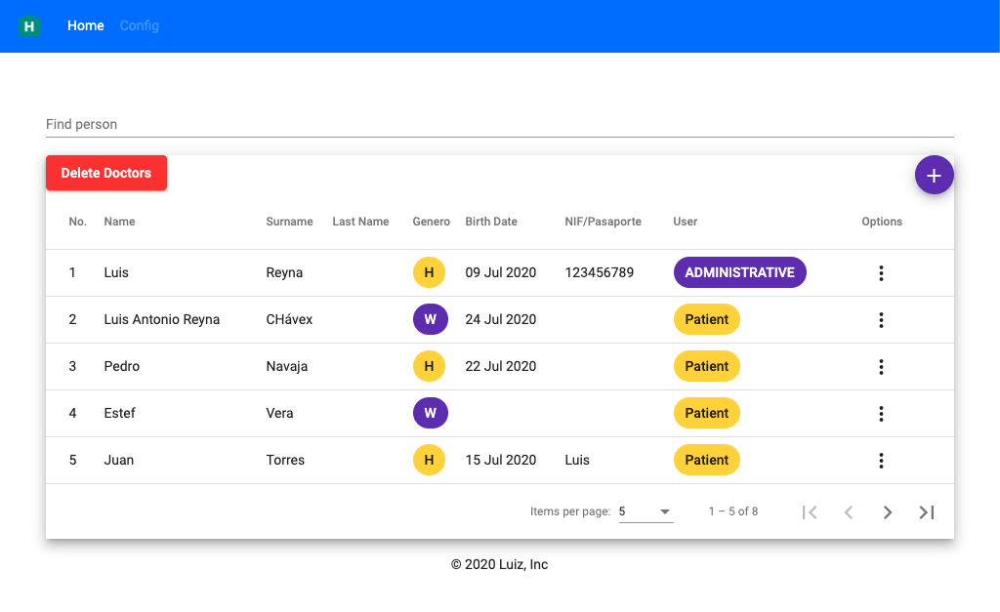

# Proyecto final RS-F
Este repositorio consta con el Front-end del proyecto final realizado para el Bootcamp impartido por Geekhubs para Ribera Salud. 

Se trata de una aplicación pensada para el sector sanitario con la que se pueden gestionar una serie de usuarios de tipo pacientes o profesionales. Incluye las operaciones básicas de un CRUD, y poder borrar todos los profesionales de tipo médicos.

## Tecnologías
El proyecto ha sido realizado con [Angular CLI](https://github.com/angular/angular-cli) version 10.0.1 y.


### Pre-requisitos
Para la correcta ejecución del proyecto en local es necesario tener instalado **Node.js**, el cual se puede obtener desde su [página oficial](https://nodejs.org/es/).

Se necesita la parte backend [HIS-PRO-BACK](https://github.com/guitarde/his-pro-back.git) y en el cual se encuentra la guía correspondiente

El último requisito para poder ejecutar el proyecto es instalar los paquetes necesarios en el repositorio descargado o clonado. Para ello, desde la carpeta donde se encuentra, se ejecuta:
```
npm install
```

### Ejecución

Para ejecutar el proyecto se utiliza con el comando de **angular**: 
```
ng serve
```

Una vez finalizado el paso anterior ya está listo para ser consultado el proyecto en la dirección  `http://localhost:4200/`.

### Credenciales 

EL sistema usa la authentication por JWT. Se habiltó usuarios por defecto en el sistema 

```
User: admin1@email.com
Pass: 123456
-----------------------

User: user1@email.com
Pass: 123456
```


### Vista general 
Aquí podemos ver visión general.

